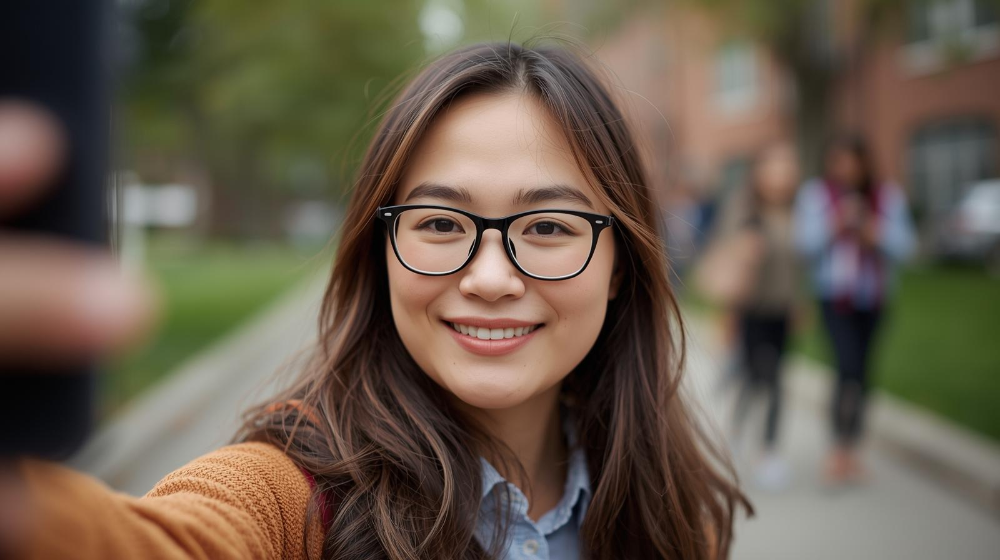
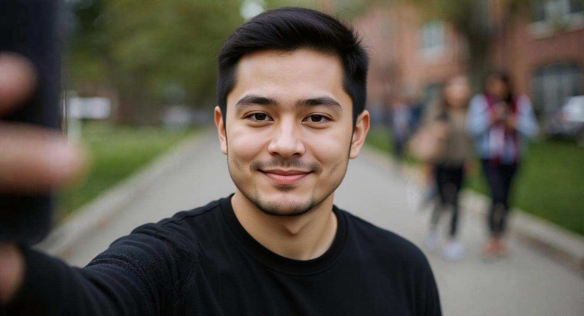
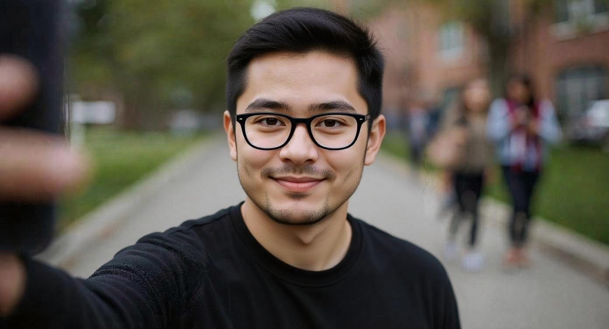

# Make 2: AI Selfie

## AI Name: Canva

### Initial Prompt
"Create selfie of the Japanese students who majors physics in US liberal arts college"

---

## First Edit Prompt

Could you make the Japanese male student's glasses more horizontally elongated, give him black hair, and dress him in black clothes?

The first image looks like a Japanese student, but she is a female. So, I ask to change to a male student. I also ask to change my hair color, my hair color is black.

---

## Second Edit Prompt

He should look younger and wear glasses.

The AI-generated selfie was of an older, middle-aged man who wasn't wearing glasses, so I instructed him to create a picture of a younger student wearing glasses instead.

---

## Reflection

The initial prompt was abstract: "A student attending an American liberal arts college and majoring in physics." The resulting selfie was of a female student and bore no resemblance to me. I believe this reflects an inherent bias in some AI systems. It's true that more Japanese women than men study abroad in the United States. Therefore, when given the prompt "Japanese exchange student," the AI likely generated a selfie of a female student because she is part of the larger demographic.

I then wrote an editing prompt for the AI to transform the female student's selfie into that of a male student with black hair wearing black clothes and glasses. The result was an image of an Asian-looking student wearing black clothes. Although he looked slightly older than the average student, the image more closely resembled my appearance. In particular, the hairstyle, eyes, and clothing captured my features.

To improve the accuracy further, I added a prompt to include glasses, resulting in the third image. The overall atmosphere, expression, and understated appearance of the image with glasses closely resembled my "real selfie." However, despite instructing the AI to make me look younger in the prompt, the resulting selfie looked like a middle-aged man. In particular, the amount of facial hair is different from my actual appearance. Also, the eyes are depicted as double-lidded, but I don't have double eyelids, so this part is also inaccurate.

