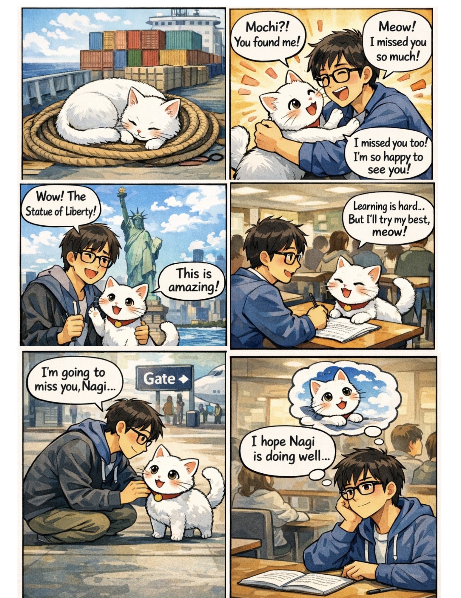

# Week 4 Comic & Storytelling

## The Artifact

## Process Notes
How did you make this?
What tools did you use?
What decisions did you make?

## Reflection
Respond to this week's reflection prompt in 200-300 words.

## Attribution & AI Use
- Tools used:
- AI prompts (summary):
- What AI generated:
- What you changed or decided:

