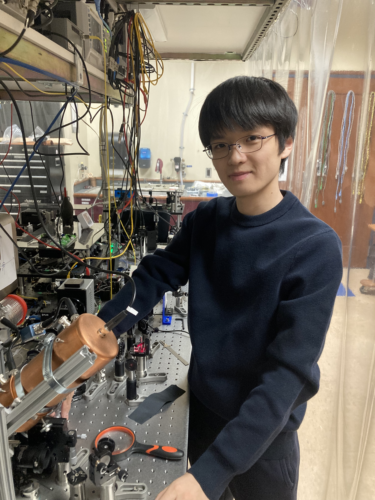

# About Me

I'm Yugen Somiya, physics major student of denison university. I have decided to dedicate my career to trapping atomic ions and exploring their applications in quantum information, driven by my fascination with the inherent uncertainty of quantum mechanics and the structure of atoms. The two main challenges in quantum technology are achieving large-scale operation and high fidelity. Although trapping atomic ions offers long coherence times and enables high-fidelity calculations, scaling up remains difficult. To address these challenges, I plan to study the mechanism and application of trapping atomic ions as well as different approaches to quantum technologies, including superconductivity, photonic technology, systems of neutral atoms, and error correction.

These approaches provide different pathways that can be implemented for trapping ions, and expanding my study to quantum error correction might be helpful for implementing large-scale computations while maintaining high fidelity. To achieve this goal, I will need to engage in deep interdisciplinary learning through class and reading journals. Since trapping atomic ions lies at the intersection of chemistry and physics, I would like to take chemistry courses to improve my understanding of atoms and ions, as well as further courses in physics at Denison.

In the research, I am particularly interested in improving the production and loading of atomic ions into traps, as necessary prerequisite for achieving a stable quantum qubit without decoherence is a crucial step for scalable quantum networks. Particularly, preventing impurity ions, such as molecular ions, from being trapped is important to reduce motional heating and decoherence even in large-scale qubits. The two main challenges in quantum technology are achieving large-scale operation and high fidelity, and although trapping atomic ions offers long coherence times and enables high-fidelity calculations, scaling up remains difficult.

To address these challenges, I plan to study the mechanism and application of trapping atomic ions as well as different approaches to quantum technologies, including superconductivity, photonic technology, systems of neutral atoms, and error correction. These approaches provide different pathways that can be implemented for trapping ions, and expanding my study to quantum error correction might be helpful for implementing large-scale computations while maintaining high fidelity. To achieve this goal, I will need to engage in deep interdisciplinary learning through class and reading journals, and since trapping atomic ions lies at the intersection of chemistry and physics, I would like to take chemistry courses to improve my understanding of atoms and ions.

In the Ph.D. program, I plan to refine my experimental skills by actively testing and iterating ideas in a hands-on laboratory environment. In the research, I am particularly interested in improving the production and loading of atomic ions into traps, as necessary prerequisite for achieving a stable quantum qubit without decoherence is a crucial step for scalable quantum networks, and preventing impurity ions, such as molecular ions, from being trapped is important to reduce motional heating and decoherence even in large-scale qubits. Ultimately, I aspire to advance large-scale quantum communication systems, shape the future of this field, and inspire the next generation of researchers.

